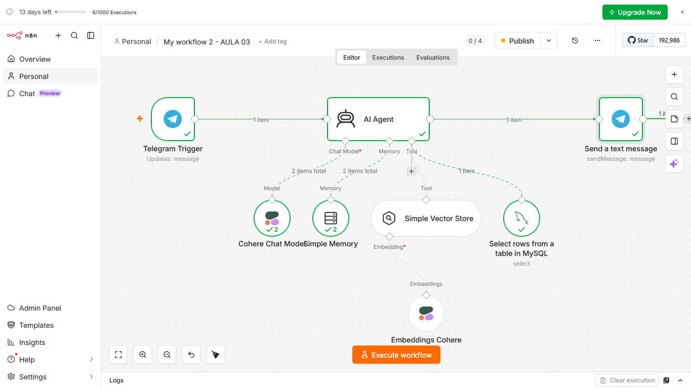
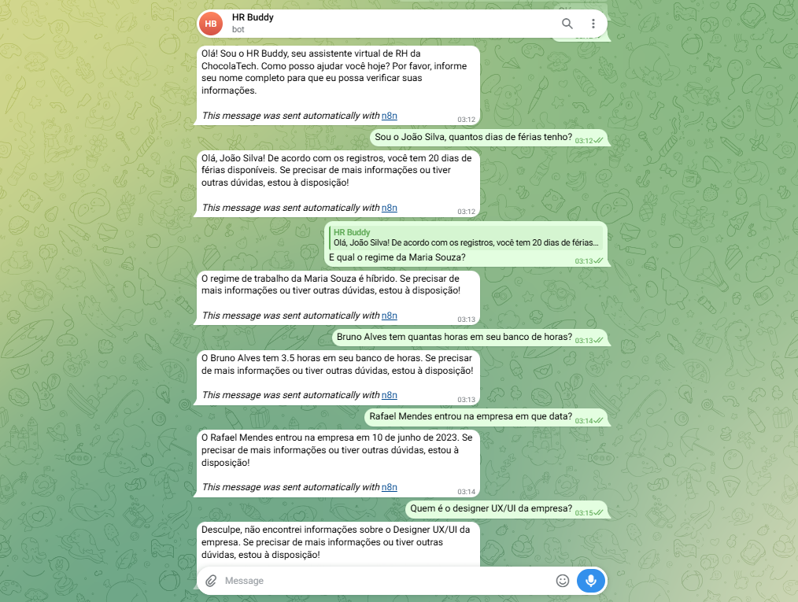

# HR Buddy - Agente de IA para Automação de RH 🚀

Projeto desenvolvido durante a **Imersão Agentes de IA**, realizada pela **Alura** em parceria com o programa **Oracle Next Education (ONE)** em junho de 2026.

O **HR Buddy** é um chatbot inteligente integrado ao Telegram que atua como um assistente virtual de Recursos Humanos. Ele é capaz de interpretar perguntas em linguagem natural, consultar um banco de dados relacional e responder a dúvidas de colaboradores sobre férias, regime de trabalho e banco de horas.

---

## 🛠️ Tecnologias e Ferramentas Utilizadas

- **n8n:** Orquestrador de workflow e construção visual do agente de IA.
- **Cohere (Chat Model & Embeddings):** LLM responsável pelo entendimento do contexto e geração de respostas.
- **MySQL (Hospedado no Railway):** Banco de dados relacional para armazenamento dos dados dos colaboradores.
- **Telegram Bot API:** Interface de comunicação com o usuário.

---

## 📋 Arquitetura do Workflow

O agente foi estruturado no n8n utilizando nós de gatilho do Telegram, memória interna, banco de vetores e ferramentas de consulta ao banco de dados:

### Como funciona o fluxo:
1. O usuário envia uma mensagem no Telegram.
2. O agente de IA processa o texto utilizando o modelo da **Cohere**.
3. Se a pergunta exigir dados do sistema, o agente aciona a ferramenta de SQL para buscar informações no **MySQL**.
4. A resposta é formatada e enviada de volta ao usuário.

---

## 🗄️ Estrutura do Banco de Dados (MySQL)

Para que o agente funcione corretamente, o banco de dados possui uma tabela chamada `funcionarios`. Caso queira replicar o projeto, configure a tabela com a seguinte estrutura conceitual:

- **nome** (Texto): Nome completo do colaborador (ex: `João Silva`).
- **saldo_ferias** (Número inteiro): Quantidade de dias de férias disponíveis (ex: `20`).
- **regime_trabalho** (Texto): Modelo de trabalho do funcionário (ex: `Híbrido`, `Presencial`).
- **banco_horas** (Número decimal): Quantidade de horas no banco (ex: `3.5`).
- **data_admissao** (Data): Data em que o funcionário entrou na empresa (ex: `2023-06-10`).

---

## 💬 Demonstração

Aqui está um exemplo do assistente respondendo dinamicamente a diferentes contextos de perguntas de RH baseando-se nos dados cadastrados:

---

## 🚀 Como Replicar este Projeto

1. Certifique-se de ter uma instância do **n8n** rodando.
2. Crie um bot no Telegram via `@BotFather` e obtenha o Token de API.
3. Obtenha as chaves de API na **Cohere**.
4. Configure a tabela `funcionarios` no seu banco de dados MySQL conforme a modelagem acima.
5. Faça o download do arquivo JSON do seu workflow no n8n.
6. No seu n8n, crie um novo fluxo e importe o arquivo JSON.
7. Configure suas credenciais em cada nó e ative o workflow!

---

## 🎓 Certificação

